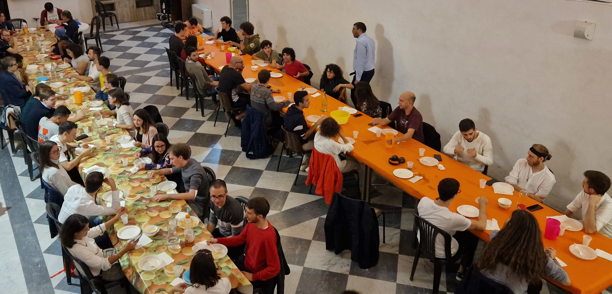
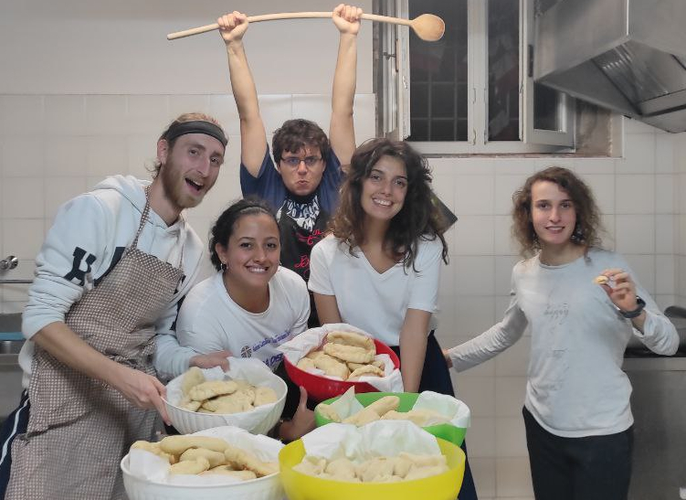

Durante l'anno, indicativamente da settembre/ottobre a maggio/giugno, ci
troviamo **tutti i sabati** per cenare insieme. L'appuntamento fisso è alle
20 in piazza San Frediano 5, campanello *Centro San Frediano*, in centro a Pisa.

\

Settimana per settimana, raccogliamo i grusfini che si mettono a disposizione
per preparare la cena, formando una squadra di **chef volontari** altamente
(s)qualificati.

\

Chiediamo a tutti quelli che partecipano alla cena un contributo di €3 per la
spesa. Fanno eccezione i cuochi, che trascorrono il pomeriggio in cucina per gli
altri, e i nuovi arrivati. Se non hai mai partecipato a una cena non hai niente
da perdere, **ti aspettiamo!**

<!-- \ -->

</body>
