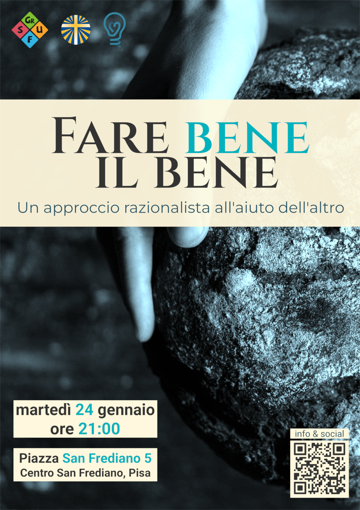
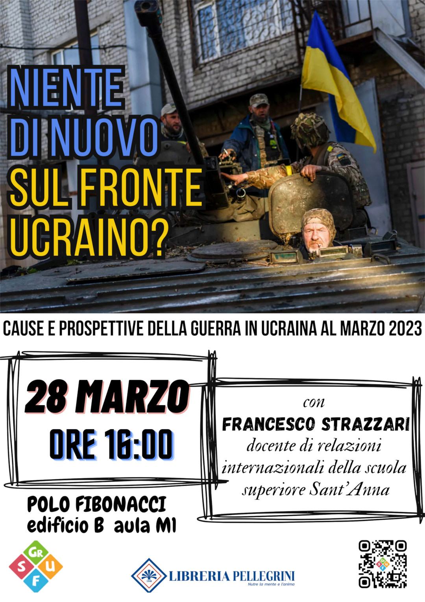
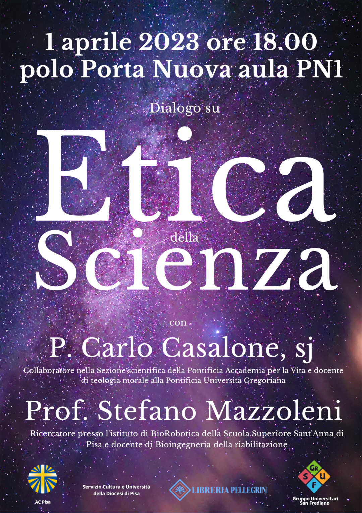
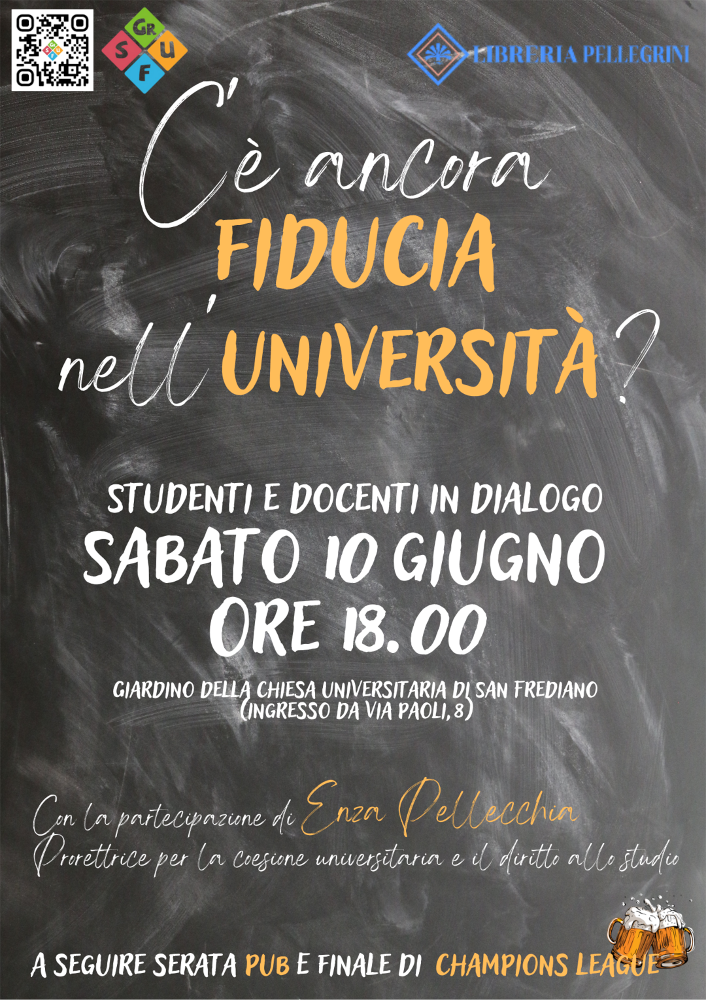
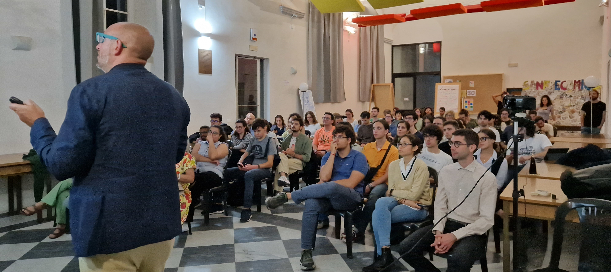

Gli incontri del martedì sono momenti di **formazione e discussione**. Sono
incentrati su un tema particolare, che generalmente affrontiamo con l'aiuto di
un **relatore esperto**.

Ecco alcuni incontri che il GrUSF ha organizzato durante l'a.a. 22/23:

<table class="locandine">
<tr>
    <td>
        \
        **Fare bene il bene**, sull'[altruismo efficace](https://en.wikipedia.org/wiki/Effective_altruism), con Raffaele Salvia
    </td>
    <td>
        \
        **Niente di nuovo sul fronte ucraino?**, con il prof. Francesco Strazzari
    </td>
</tr>
<tr>
    <td>
        \
        **Etica della scienza**, con padre Carlo Casalone e il prof. Stefano Mazzoleni
    </td>
    <td>
        \
        **C'è ancora fiducia nell'università?**, con la prorettrice Enza Pellecchia e il prof. Alessio Cavicchi
    </td>
</tr>
</table>

Gli incontri sono circa uno al mese, e si tengono generalmente il martedì sera
in piazza San Frediano 5, campanello *Centro San Frediano*, in centro a Pisa.
Tuttavia, almeno un paio di volte all'anno prepariamo un **incontro in
facoltà**, cioè tenuto in un'aula dell'Università di Pisa.

Puoi tenerti aggiornato sugli incontri GrUSF seguendoci
[sui nostri social](link.html).

\
